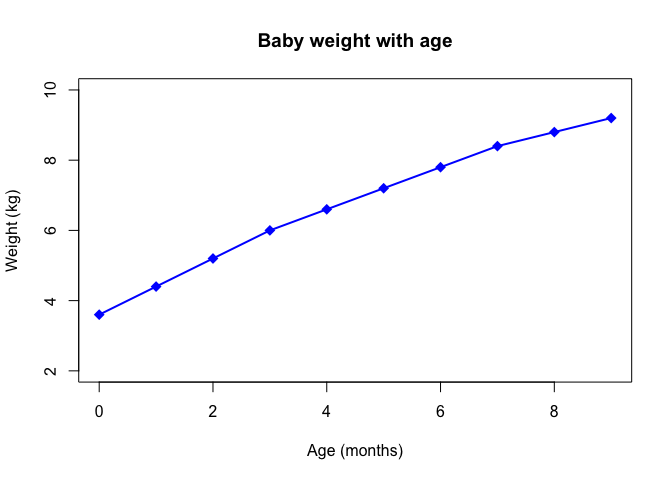

BGGN213 Class 5: R Graphics
================
Chenlu Bao
Fri Apr 19st 2019

``` r
# Class 5 R graphics and plots

# 1B. get the data in
weight <- read.table("bimm143_05_rstats/weight_chart.txt", header = TRUE)

# 2A. plot a scaterplot of age vs weight
plot(weight$Age, weight$Weight, xlab = "Age (months)", ylab = "Weight (kg)", 
     pch = 18, col = "blue", type = "o", cex = 1.5, lwd = 2, ylim = c(2,10), 
     main = "Baby weight with age" )
```



``` r
# 2B. Barplot
feat <- read.table("bimm143_05_rstats/feature_counts.txt",header = TRUE, 
                  sep = "\t")

# 2B. I could also use read.delim() function here like this
read.delim("bimm143_05_rstats/feature_counts.txt")
```

    ##                    Feature Count
    ## 1            Messenger RNA 79049
    ## 2         Coding Sequences 50770
    ## 3                    Genes 32029
    ## 4            Transfer RNAs 26248
    ## 5              CpG islands 13840
    ## 6              Pseudogenes  5195
    ## 7               Micro-RNAs  1638
    ## 8     Small nucleolar RNAs  1602
    ## 9       Small nuclear RNAs  1431
    ## 10       Miscellaneous RNA   491
    ## 11 Immunoglobulin Segments   474
    ## 12          Ribosomal RNAs   341

``` r
# my lables are cliped, I need to change the margisn
old.par <- par()$mar

par(mar=c(3.1,11,4.1,2.1))
barplot(feat$Count, names.arg = feat$Feature, horiz = TRUE, las = 1, main = 
          "Number of features in the mouse GRCm38 genome", xlim = c(0, 80000))
```


``` r
par(mar=old.par)

#2C
hist(c(rnorm(1000), rnorm(1000)+4), xlab = "x", ylab = "Frequency", breaks = 
       100, main = "Histogram of x")
```


``` r
# 3A
mf <- read.delim("bimm143_05_rstats/male_female_counts.txt", header = TRUE)
barplot(mf$Count, names.arg = mf$Sample, las = 2, col = rainbow(10))
```


``` r
# 3B
genes <- read.delim("bimm143_05_rstats/up_down_expression.txt", header = TRUE)
nrow(genes)
```

    ## [1] 5196

``` r
ncol(genes)
```

    ## [1] 4

``` r
table(genes$State)
```

    ## 
    ##       down unchanging         up 
    ##         72       4997        127

``` r
plot(genes$Condition1, genes$Condition2, col = genes$State)
```


``` r
old.palette <- palette()
palette(c("blue", "gray", "red"))
plot(genes$Condition1, genes$Condition2, col=genes$State, 
     xlab = "Expression condition 1", ylab = "Expression condition 2")
```


